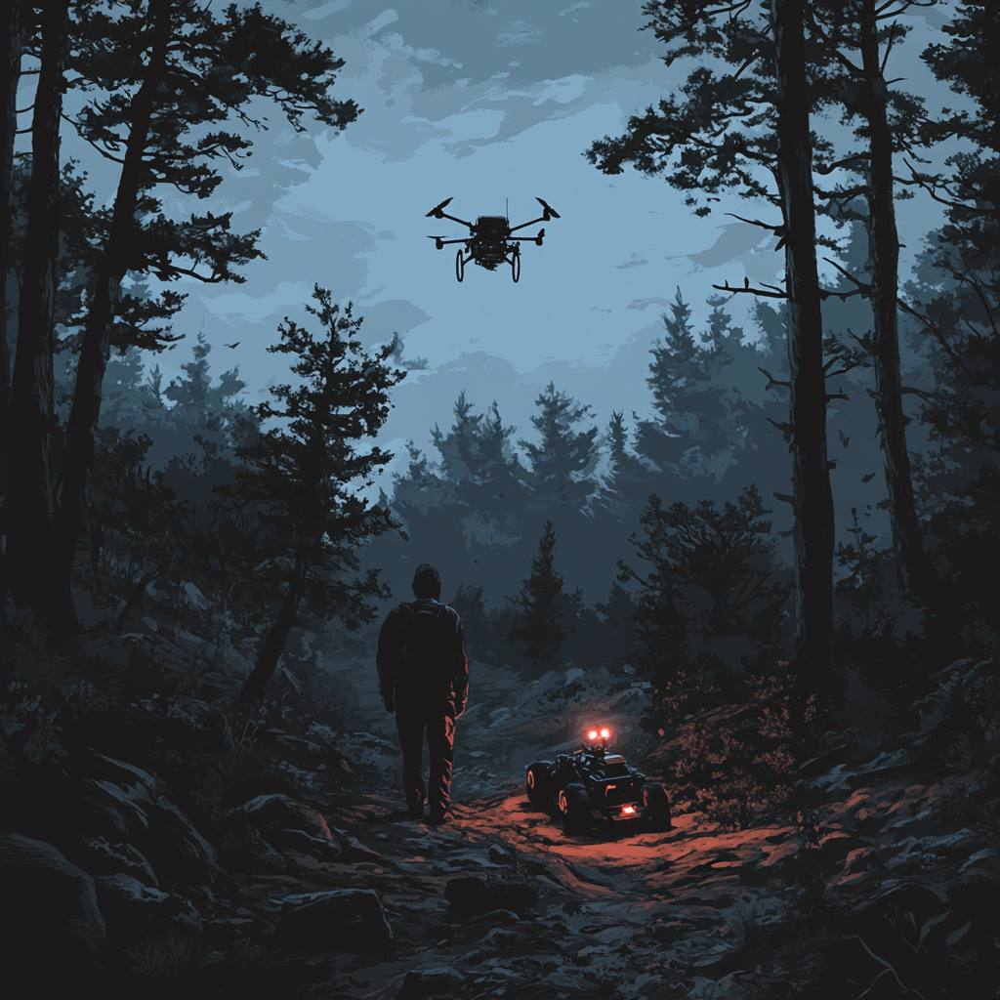
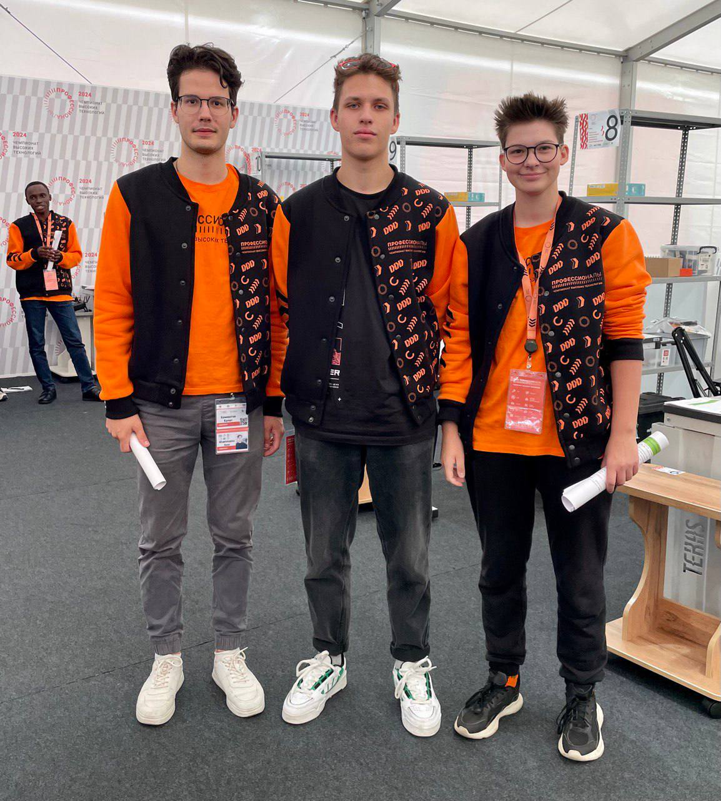
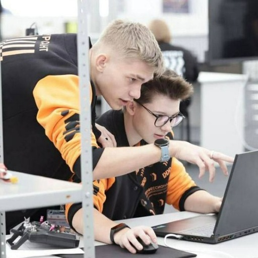

## О проекте "Мы найдем тебя"
## About project "We will find You!"
<picture>
 <source media="(prefers-color-scheme: dark)" srcset="images/3.jpg">
 <source media="(prefers-color-scheme: light)" srcset="images/3.jpg">
 
</picture>

### Цель и актуальность работы
Организация спасательной операции (миссии) с формированием полётного задания в пересеченной местности при помощи КБС (Комплексной беспилотной системы) с использованием нейросети: обнаружение, доставка груза (без сброса), передача координат. Задание расчитано на самостоятельный забор груза. На этот проект нас вдохновил добровольческий поисковый отряд " ЛизаАлерт", ставящий своей задачей оперативное реагирование и гражданское содействие в поиске пропавших

Использование технологий искусственного интеллекта позволяет не только улучшить точность идентификации объектов, но и способствует адаптации к изменениям окружающей среды и постоянному самосовершенствованию системы за счет обучения на собранных данных.
### Purpose and relevance of the work
Organization of a rescue operation (mission) with the creation of a flight task in rough terrain using a integrated drone system using a neural network: detection, cargo delivery (without dumping), transmission of coordinates. The task is designed for independent cargo collection. We were inspired to this project by the volunteer search team "LizaAlert", which aims to provide rapid response for civilian assistance in the search for the missing

The use of artificial intelligence technologies allows not only to improve the accuracy of object identification, but also contributes to adaptation to environmental changes and continuous self-improvement of the system through training on the collected data.

## Миссия 
**`Задание для коптера`**
* Взлететь с точки взлёта. Световая индикация **`Lime`**. 
* Облететь полигон. Световая индикация **`Crimson`**.
* При обнаружении Ровера цвет светодиодной ленты поменять на **`Yellow`** , при обнаружении камня(мяч) моргнуть **`Blue`** цветом,  при обнаружении дерева(цветка) моргнуть **`SaddleBrown`**, при обнаружении человека (**Манекена**) моргнуть **`Green`** . Определять объекты с помощью компьютерного зрения.
* В топике подписать **`Название всех объектов`**, обозначить их цвет и обвести контур всех обнаруженных объектов.
* **`Создать отчёт`**, в котором будет находится информация обо всех обнаруженных объектах, их место расположения и цвет.
* Посадка в точку взлёта. Световая индикация **`Purple`**

**`Задание для ровера`** 
* Выехать с зоны парковки. Вкл. фары.
* Начать алгоритм движения по траектории, избегая столкновений с элементами полигона
* Найти объект. Моргнуть трижды фарами. Передать груз
* Вернуться в зону парковки. Выкл. фары

[**Порядок выполнения проверки**](https://1drv.ms/x/c/8e997581c10a3126/ETir6DfYjeVNn_z09sgygx0BI8vJJylXbXAf2D9sMxTCXQ?e=QzCvJ1)

[**Отчет о выполнении проверок**](https://1drv.ms/w/c/8e997581c10a3126/EY7g0MCekoZJtL6cUr-C9bMBN1yOBsuLruaSWFRJyRH0dw?e=wnBB3V)

## Mission 
**`Task for the copter`**
* Take off from the takeoff point. Light indication **`Lime`**. 
* Fly around the polygon. Light indication **`Crimson`**.
* When detecting a Rover, change the color of the LED strip to **`Yellow`** , when detecting a stone(ball), blink **`Blue`** color, when detecting a tree(flower), blink **`SaddleBrown`**, when detecting a person (**Mannequin**), blink **`Green`** . Identify objects using computer vision.
* In the topic, sign **`The name of all objects is `**, indicate their color and outline all detected objects.
* **`Create a report`**, which will contain information about all detected objects, their location and color.
* Landing at the take-off point. Light indication **`Purple`**

**`Task for the rover`** 
* Exit the parking area. Lights on.
* Start the trajectory movement algorithm, avoiding collisions with polygon elements
* Find an object. Blink the headlights three times. Transfer the cargo
* Return to the parking area. Lights off

[**The order of execution проверки**](https://1drv.ms/x/c/8e997581c10a3126/ETir6DfYjeVNn_z09sgygx0BI8vJJylXbXAf2D9sMxTCXQ?e=QzCvJ1)

[**Progress Report проверок**](https://1drv.ms/w/c/8e997581c10a3126/EY7g0MCekoZJtL6cUr-C9bMBN1yOBsuLruaSWFRJyRH0dw?e=wnBB3V)

## План работ
* Продумать алгоритм работы ​
* Создать нейронную сеть​
* Написать код распознавания объектов​
* Написать алгоритм движения ровера по данным полученным из неиросети

Подробнее вы можете ознакомиться с планом в [**приложении**](https://1drv.ms/x/c/8e997581c10a3126/EZwav9RLN3lFmgS0CpPVzr8BZBBNfjNsvDEk8561q5dxOw?e=LDzxkx)
## Work plan
* Think over the algorithm of work ​
* Create a neural network​
* Write object recognition code​
* Write an algorithm for the rover's movement based on data received from a non-network

You can read more about the plan in [**приложении**](https://1drv.ms/x/c/8e997581c10a3126/EZwav9RLN3lFmgS0CpPVzr8BZBBNfjNsvDEk8561q5dxOw?e=LDzxkx)

## Нейронная сеть
Она была создана при помощи **`yolov8`** и **`roboflow`**. При помощи **`roboflow`** мы создали dataset и загрузили его в **`ultralytics hub`**.

## Neural network
It was created using **`yolov8`** and **`roboflow`**. Using **`roboflow`**, we created a dataset and uploaded it to **`ultralytics hub'**.

<picture>
 <source media="(prefers-color-scheme: dark)" srcset="images/4.png">
 <source media="(prefers-color-scheme: light)" srcset="images/4.png">
 
</picture

## Выполнение миссии
Для выполнения миссии нам понадобилась библиотека **`opencv`**. Мы использовали различные маски для детекции объектов для последующего использования, чтобы найти объекты. Был создан алгоритм для проследующего движения ровера к месту обнаружения пострадавшего.

## Completing the mission
To complete the mission, we needed the **`opencv`** library. We used various masks to detect objects for later use to find objects. An algorithm was created for the subsequent movement of the rover to the location of the victim.

## О команде
В нашей команде 5 человек:

**`Хамматов Булат​`**:  тестировка и отладка оборудования

**`Иваненко Артём`**:  создание и обучение нейронных сетей

**`Толкунов Иван`**:  алгоритм движения ровера

**`Мухина Кира`**:  программа для детекции объектов

**`Зуева Алина `**:  Team-lider

**`Роли и обязоности приведены ниже `**

| ФИО Участника             | Роль             | Обязанности                           |
| ------------------------- | ---------------- | --------------------------------------|
| Иваненко Артем Сергеевич  | ML               | Создание и обучение нейронных сетей   |
| Мухина Кира Сергеевна     | Программист дрон |   Программа для детекции объектов     |
| Хамматов Булат  Иршатович | Тестировщик      | Тестировка и отладка оборудования     |
|Толкунов Иван Сергеевич    | Программист ровер| Алгоритм движения ровера              |
|Зуева Алина Николаевна     | Team-leader       | Координация проекта, тайм-мэнеджмент  |

Хотим представить решение поставленной задачи в компетенции **`"Искусвенный интелект в комплексных беспилотных системах"`**.

## About the team
There are 5 people in our team:

**Hammatov Bulat**: testing and debugging of equipment

**`Ivanenko Artyom`**: creation and training of neural networks

**`Tolkunov Ivan`**: the rover's motion algorithm

**`Mukhina Kira`**: an object detection program

**`Zueva Alina '**: Team-lider

**`The roles and responsibilities are listed below `**

| Participant's full name | Role | Responsibilities |
| ------------------------- | ---------------- | --------------------------------------|
| Artem Sergeevich Ivanenko | ML | Creation and training of neural networks |
| Mukhina Kira Sergeevna | Drone Programmer | Object detection software |
| Bulat Irshatovich Hammatov | Tester | Testing and debugging of equipment |
|Tolkunov Ivan Sergeevich | Programmer rover| The rover's motion algorithm |
|Zueva Alina Nikolaevna | Team-leader | Project coordination, time management |

## [**результат проделанной работы**](https://disk.yandex.ru/i/mKpjEilXAF9ebw)

We want to present a solution to the task in the competence of **`"Artificial intelligence in complex unmanned systems"`**.

## 📖 содержание
* **`обучение`** [нейронной сети](https://github.com/Muha-bz/Cyber-AI-drone/blob/main/Cyber_AI/Сyber-AI-drone.pt)
  
* **`результат тестирования:`** [нейронки]()
* **`распознование пострадавшего`** [программа](https://github.com/Muha-bz/Cyber-AI-drone/blob/main/Cyber_AI/programm_Copter.py)
* **`транспортировка набора выживания и аптечки`** [программа] ()
* **`Пояснительная `** [записка](https://github.com/Muha-bz/Cyber-AI-drone/blob/main/Cyber_AI/Пояснительная%20записка.docx)
* **`результат проделанной работы`** [видео](https://disk.yandex.ru/i/mKpjEilXAF9ebw)

## 📖 Content
* **`learning`** [neural network](https://github.com/Muha-bz/Cyber-AI-drone/blob/main/Cyber_AI/Сyber-AI-drone.pt )

* **`test result:`** [neurons]()
* **`victim recognition`** [program](https://github.com/Muha-bz/Cyber-AI-drone/blob/main/Cyber_AI/programm_Copter.py )
* **`transportation of survival kit and first aid kit`** [program]()
* **`Documentation `** [note](https://github.com/Muha-bz/Cyber-AI-drone/blob/main/Cyber_AI/Documentation %20 note.docx)
* **`the result of the work done`** [video] ()
